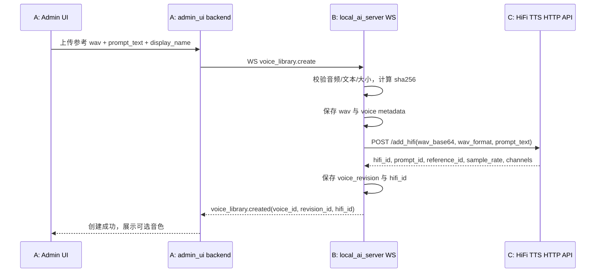
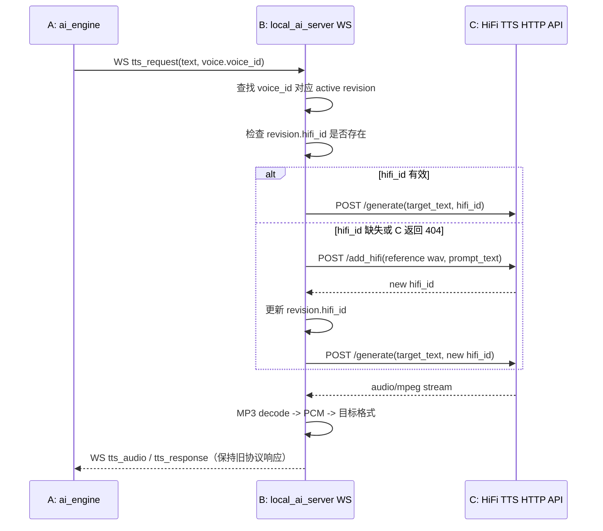
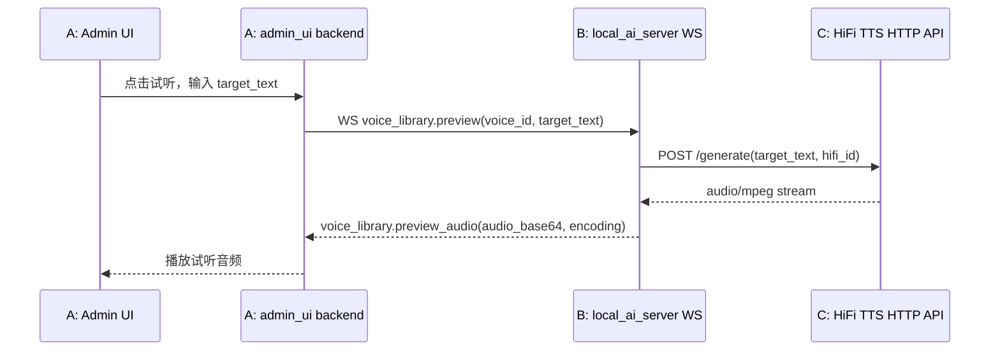

# A/B/C 三机 HiFi 音色库集成规范

本文档定义在三机部署中新增“音色库”能力的协作协议。

- A 服务器：`admin_ui` + `ai_engine`
- B 服务器：`local_ai_server`
- C 服务器：HiFi TTS 服务，提供现有 `/add_hifi`、`/generate`、`/hifi/{hifi_id}` API

核心目标：

- A 可以在 Admin UI 中上传、试用、切换参考音频。
- B 维护音色库，负责保存参考音频、保存元数据、调用 C 创建或刷新 `hifi_id`。
- C 仍只负责 HiFi TTS 推理与缓存。
- A 与 B 的通信仍使用现有 WebSocket 通道，不新增额外鉴权。
- 现有 TTS WebSocket 消息保持向后兼容：不传音色字段时继续走默认 TTS。

---

## 1. 关键结论

### 1.1 新增概念

| 字段 | 归属 | 是否稳定 | 含义 |
|---|---|---:|---|
| `voice_id` | B | 稳定 | B 音色库业务主键，A 应长期保存此字段 |
| `voice_revision_id` | B | 稳定 | 某次参考音频与 prompt_text 的版本号 |
| `hifi_id` | C | 不稳定 | C `/add_hifi` 返回的缓存 ID，C 重启或清缓存后可能失效 |
| `prompt_text` | A/B | 稳定 | 参考音频对应文本 |
| `reference_audio_sha256` | B | 稳定 | 参考音频去重与审计摘要 |

### 1.2 主键策略

A 的业务配置必须以 `voice_id` 为主；`hifi_id` 只能作为加速字段保存。

原因：

- `hifi_id` 是 C 的运行时缓存，不是业务资产。
- C 重启后，旧 `hifi_id` 可能 404。
- B 可以根据 `voice_id` 找到参考音频并重新调用 C `/add_hifi` 获取新的 `hifi_id`。

### 1.3 WebSocket 兼容策略

现有 TTS 请求保持可用：

```json
{
  "type": "tts_request",
  "call_id": "call-001",
  "mode": "tts",
  "text": "你好"
}
```

新增可选字段后：

```json
{
  "type": "tts_request",
  "call_id": "call-001",
  "mode": "tts",
  "text": "你好",
  "voice": {
    "voice_id": "voice_01JABCDEF123456789",
    "voice_revision_id": "vrev_01JABCDEF123456789",
    "hifi_id": "optional-fast-path-cache-id"
  }
}
```

兼容要求：

- B 必须接受无 `voice` 的旧请求。
- A 可以只传 `voice_id`，B 负责解析最新 active revision。
- A 可以同时传 `voice_id + hifi_id`，B 必须验证 `hifi_id` 可用；不可用时自动刷新。
- TTS 响应消息类型不变，仍返回现有 `tts_audio` / `tts_response` 形式。

---

## 2. 总体运行时时序图

### 2.1 上传参考音频并创建音色



### 2.2 通话中使用指定音色 TTS



### 2.3 Admin UI 试听音色



---

## 3. A/B WebSocket 通用信封

所有新增音色库消息复用现有 A→B WebSocket 连接与 `LOCAL_WS_AUTH_TOKEN`。不新增鉴权方式。

### 3.1 通用请求 Envelope Schema

```json
{
  "$schema": "https://json-schema.org/draft/2020-12/schema",
  "$id": "VoiceLibraryWsRequestEnvelope",
  "type": "object",
  "required": ["type", "request_id"],
  "properties": {
    "type": {
      "type": "string",
      "description": "消息类型，例如 voice_library.create 或 tts_request"
    },
    "request_id": {
      "type": "string",
      "minLength": 1,
      "description": "A 生成的幂等/追踪 ID"
    },
    "call_id": {
      "type": "string",
      "description": "通话内请求才需要"
    },
    "payload": {
      "type": "object"
    }
  },
  "additionalProperties": true
}
```

### 3.2 通用成功响应 Envelope Schema

```json
{
  "$schema": "https://json-schema.org/draft/2020-12/schema",
  "$id": "VoiceLibraryWsSuccessEnvelope",
  "type": "object",
  "required": ["type", "request_id", "ok", "payload"],
  "properties": {
    "type": {
      "type": "string"
    },
    "request_id": {
      "type": "string"
    },
    "ok": {
      "const": true
    },
    "payload": {
      "type": "object"
    }
  },
  "additionalProperties": false
}
```

### 3.3 通用错误响应 Envelope Schema

```json
{
  "$schema": "https://json-schema.org/draft/2020-12/schema",
  "$id": "VoiceLibraryWsErrorEnvelope",
  "type": "object",
  "required": ["type", "request_id", "ok", "error"],
  "properties": {
    "type": {
      "type": "string",
      "enum": ["voice_library.error"]
    },
    "request_id": {
      "type": "string"
    },
    "ok": {
      "const": false
    },
    "error": {
      "type": "object",
      "required": ["code", "message"],
      "properties": {
        "code": {
          "type": "string",
          "enum": [
            "invalid_request",
            "audio_too_large",
            "unsupported_audio_format",
            "voice_not_found",
            "revision_not_found",
            "hifi_backend_unavailable",
            "hifi_cache_invalid",
            "internal_error"
          ]
        },
        "message": {
          "type": "string"
        },
        "retryable": {
          "type": "boolean",
          "default": false
        },
        "details": {
          "type": "object"
        }
      },
      "additionalProperties": false
    }
  },
  "additionalProperties": false
}
```

---

## 4. A/B 音色库 WebSocket API

### 4.1 创建音色：`voice_library.create`

用途：A 上传参考音频到 B，B 保存音色并调用 C `/add_hifi` 返回 `hifi_id`。

#### Request Schema

```json
{
  "$schema": "https://json-schema.org/draft/2020-12/schema",
  "$id": "VoiceLibraryCreateRequest",
  "type": "object",
  "required": ["type", "request_id", "payload"],
  "properties": {
    "type": {
      "const": "voice_library.create"
    },
    "request_id": {
      "type": "string"
    },
    "payload": {
      "type": "object",
      "required": ["display_name", "wav_base64", "wav_format", "prompt_text"],
      "properties": {
        "display_name": {
          "type": "string",
          "minLength": 1,
          "maxLength": 80
        },
        "wav_base64": {
          "type": "string",
          "contentEncoding": "base64",
          "description": "完整 wav 文件字节 base64，不允许 data URI"
        },
        "wav_format": {
          "type": "string",
          "enum": ["wav"]
        },
        "prompt_text": {
          "type": "string",
          "minLength": 1,
          "maxLength": 500
        },
        "source_filename": {
          "type": "string",
          "maxLength": 255
        },
        "language": {
          "type": "string",
          "default": "zh-CN"
        },
        "tags": {
          "type": "array",
          "items": {
            "type": "string",
            "maxLength": 32
          },
          "default": []
        },
        "metadata": {
          "type": "object",
          "additionalProperties": true
        },
        "set_active": {
          "type": "boolean",
          "default": true
        }
      },
      "additionalProperties": false
    }
  },
  "additionalProperties": false
}
```

#### Response Schema

```json
{
  "$schema": "https://json-schema.org/draft/2020-12/schema",
  "$id": "VoiceLibraryCreateResponse",
  "type": "object",
  "required": ["type", "request_id", "ok", "payload"],
  "properties": {
    "type": {
      "const": "voice_library.created"
    },
    "request_id": {
      "type": "string"
    },
    "ok": {
      "const": true
    },
    "payload": {
      "type": "object",
      "required": ["voice_id", "voice_revision_id", "hifi_id", "display_name", "status"],
      "properties": {
        "voice_id": {
          "type": "string"
        },
        "voice_revision_id": {
          "type": "string"
        },
        "hifi_id": {
          "type": "string"
        },
        "display_name": {
          "type": "string"
        },
        "status": {
          "type": "string",
          "enum": ["ready"]
        },
        "reference_audio_sha256": {
          "type": "string"
        },
        "c_backend": {
          "type": "object",
          "properties": {
            "prompt_id": { "type": "string" },
            "reference_id": { "type": "string" },
            "feat_dim": { "type": "integer" },
            "sample_rate": { "type": "integer" },
            "channels": { "type": "integer" }
          },
          "additionalProperties": true
        },
        "created_at": {
          "type": "string",
          "format": "date-time"
        }
      },
      "additionalProperties": false
    }
  },
  "additionalProperties": false
}
```

### 4.2 查询音色列表：`voice_library.list`

#### Request Schema

```json
{
  "$schema": "https://json-schema.org/draft/2020-12/schema",
  "$id": "VoiceLibraryListRequest",
  "type": "object",
  "required": ["type", "request_id"],
  "properties": {
    "type": { "const": "voice_library.list" },
    "request_id": { "type": "string" },
    "payload": {
      "type": "object",
      "properties": {
        "include_deleted": { "type": "boolean", "default": false },
        "limit": { "type": "integer", "minimum": 1, "maximum": 200, "default": 50 },
        "cursor": { "type": "string" }
      },
      "additionalProperties": false
    }
  },
  "additionalProperties": false
}
```

#### Response Schema

```json
{
  "$schema": "https://json-schema.org/draft/2020-12/schema",
  "$id": "VoiceLibraryListResponse",
  "type": "object",
  "required": ["type", "request_id", "ok", "payload"],
  "properties": {
    "type": { "const": "voice_library.list_result" },
    "request_id": { "type": "string" },
    "ok": { "const": true },
    "payload": {
      "type": "object",
      "required": ["items"],
      "properties": {
        "items": {
          "type": "array",
          "items": { "$ref": "#/$defs/voice_summary" }
        },
        "next_cursor": { "type": ["string", "null"] }
      },
      "$defs": {
        "voice_summary": {
          "type": "object",
          "required": ["voice_id", "display_name", "status", "active_revision_id"],
          "properties": {
            "voice_id": { "type": "string" },
            "display_name": { "type": "string" },
            "status": { "type": "string", "enum": ["ready", "degraded", "deleted"] },
            "active_revision_id": { "type": "string" },
            "latest_hifi_id": { "type": ["string", "null"] },
            "prompt_text": { "type": "string" },
            "reference_audio_sha256": { "type": "string" },
            "created_at": { "type": "string", "format": "date-time" },
            "updated_at": { "type": "string", "format": "date-time" }
          },
          "additionalProperties": false
        }
      },
      "additionalProperties": false
    }
  },
  "additionalProperties": false
}
```

### 4.3 更新音色元数据：`voice_library.update`

只更新 B 的业务元数据，不重建 C 的 `hifi_id`。

#### Request Schema

```json
{
  "$schema": "https://json-schema.org/draft/2020-12/schema",
  "$id": "VoiceLibraryUpdateRequest",
  "type": "object",
  "required": ["type", "request_id", "payload"],
  "properties": {
    "type": { "const": "voice_library.update" },
    "request_id": { "type": "string" },
    "payload": {
      "type": "object",
      "required": ["voice_id"],
      "properties": {
        "voice_id": { "type": "string" },
        "display_name": { "type": "string", "minLength": 1, "maxLength": 80 },
        "tags": {
          "type": "array",
          "items": { "type": "string", "maxLength": 32 }
        },
        "metadata": {
          "type": "object",
          "additionalProperties": true
        }
      },
      "additionalProperties": false
    }
  },
  "additionalProperties": false
}
```

#### Response Schema

```json
{
  "$schema": "https://json-schema.org/draft/2020-12/schema",
  "$id": "VoiceLibraryUpdateResponse",
  "type": "object",
  "required": ["type", "request_id", "ok", "payload"],
  "properties": {
    "type": { "const": "voice_library.updated" },
    "request_id": { "type": "string" },
    "ok": { "const": true },
    "payload": {
      "type": "object",
      "required": ["voice_id", "updated_at"],
      "properties": {
        "voice_id": { "type": "string" },
        "updated_at": { "type": "string", "format": "date-time" }
      },
      "additionalProperties": false
    }
  },
  "additionalProperties": false
}
```

### 4.4 删除音色：`voice_library.delete`

B 软删除业务音色，并尽力调用 C `DELETE /hifi/{hifi_id}`。

#### Request Schema

```json
{
  "$schema": "https://json-schema.org/draft/2020-12/schema",
  "$id": "VoiceLibraryDeleteRequest",
  "type": "object",
  "required": ["type", "request_id", "payload"],
  "properties": {
    "type": { "const": "voice_library.delete" },
    "request_id": { "type": "string" },
    "payload": {
      "type": "object",
      "required": ["voice_id"],
      "properties": {
        "voice_id": { "type": "string" },
        "hard_delete": { "type": "boolean", "default": false }
      },
      "additionalProperties": false
    }
  },
  "additionalProperties": false
}
```

#### Response Schema

```json
{
  "$schema": "https://json-schema.org/draft/2020-12/schema",
  "$id": "VoiceLibraryDeleteResponse",
  "type": "object",
  "required": ["type", "request_id", "ok", "payload"],
  "properties": {
    "type": { "const": "voice_library.deleted" },
    "request_id": { "type": "string" },
    "ok": { "const": true },
    "payload": {
      "type": "object",
      "required": ["voice_id", "deleted_at"],
      "properties": {
        "voice_id": { "type": "string" },
        "deleted_at": { "type": "string", "format": "date-time" },
        "c_cache_deleted": { "type": "boolean" }
      },
      "additionalProperties": false
    }
  },
  "additionalProperties": false
}
```

### 4.5 试听音色：`voice_library.preview`

用于 Admin UI 快速试听。返回建议使用 base64 音频，避免浏览器直接处理 B→C 的私网地址。

#### Request Schema

```json
{
  "$schema": "https://json-schema.org/draft/2020-12/schema",
  "$id": "VoiceLibraryPreviewRequest",
  "type": "object",
  "required": ["type", "request_id", "payload"],
  "properties": {
    "type": { "const": "voice_library.preview" },
    "request_id": { "type": "string" },
    "payload": {
      "type": "object",
      "required": ["voice_id", "target_text"],
      "properties": {
        "voice_id": { "type": "string" },
        "voice_revision_id": { "type": "string" },
        "hifi_id": { "type": "string" },
        "target_text": { "type": "string", "minLength": 1, "maxLength": 500 },
        "max_generate_length": { "type": "integer", "default": 2000 },
        "temperature": { "type": "number", "default": 1.0 },
        "cfg_value": { "type": "number", "default": 2.0 },
        "response_audio_format": {
          "type": "string",
          "enum": ["mp3_base64", "mulaw_8000_base64"],
          "default": "mp3_base64"
        }
      },
      "additionalProperties": false
    }
  },
  "additionalProperties": false
}
```

#### Response Schema

```json
{
  "$schema": "https://json-schema.org/draft/2020-12/schema",
  "$id": "VoiceLibraryPreviewResponse",
  "type": "object",
  "required": ["type", "request_id", "ok", "payload"],
  "properties": {
    "type": { "const": "voice_library.preview_audio" },
    "request_id": { "type": "string" },
    "ok": { "const": true },
    "payload": {
      "type": "object",
      "required": ["voice_id", "hifi_id", "audio_base64", "audio_format"],
      "properties": {
        "voice_id": { "type": "string" },
        "voice_revision_id": { "type": "string" },
        "hifi_id": { "type": "string" },
        "audio_base64": { "type": "string", "contentEncoding": "base64" },
        "audio_format": { "type": "string", "enum": ["mp3", "mulaw_8000"] },
        "duration_ms": { "type": "integer" },
        "ttfb_ms": { "type": "number" },
        "total_ms": { "type": "number" }
      },
      "additionalProperties": false
    }
  },
  "additionalProperties": false
}
```

---

## 5. 更新后的 TTS WebSocket 协议

### 5.1 `tts_request` 扩展请求 Schema

这是最关键的兼容点：`type`、`call_id`、`mode`、`text` 不变，只新增可选 `voice`。

```json
{
  "$schema": "https://json-schema.org/draft/2020-12/schema",
  "$id": "TtsRequestWithOptionalVoice",
  "type": "object",
  "required": ["type", "call_id", "mode", "text"],
  "properties": {
    "type": { "const": "tts_request" },
    "call_id": { "type": "string" },
    "mode": { "const": "tts" },
    "text": { "type": "string", "minLength": 1 },
    "voice": {
      "type": "object",
      "properties": {
        "voice_id": {
          "type": "string",
          "description": "推荐字段，B 音色库主键"
        },
        "voice_revision_id": {
          "type": "string",
          "description": "可选，指定某个历史版本；不传则使用 active revision"
        },
        "hifi_id": {
          "type": "string",
          "description": "可选快速路径；B 必须能在失效时回退到 voice_id 重建"
        }
      },
      "additionalProperties": false
    },
    "format": {
      "type": "object",
      "properties": {
        "encoding": { "type": "string", "enum": ["mulaw", "ulaw", "pcm16"] },
        "sample_rate": { "type": "integer", "enum": [8000, 16000] }
      },
      "additionalProperties": false
    },
    "tts_options": {
      "type": "object",
      "properties": {
        "max_generate_length": { "type": "integer" },
        "temperature": { "type": "number" },
        "cfg_value": { "type": "number" }
      },
      "additionalProperties": false
    }
  },
  "additionalProperties": true
}
```

### 5.2 `tts_audio` 响应 Schema（保持旧语义）

如果现有实现已返回二进制帧或现有 `tts_response.audio_data`，可以继续保持；新增音色库不要求 A 改播放逻辑。

```json
{
  "$schema": "https://json-schema.org/draft/2020-12/schema",
  "$id": "TtsAudioResponse",
  "type": "object",
  "required": ["type", "call_id"],
  "properties": {
    "type": { "type": "string", "enum": ["tts_audio", "tts_response"] },
    "call_id": { "type": "string" },
    "audio_data": {
      "type": "string",
      "contentEncoding": "base64",
      "description": "当响应为 JSON 音频时使用；二进制帧响应可不传"
    },
    "encoding": { "type": "string", "enum": ["mulaw", "ulaw", "pcm16"] },
    "sample_rate": { "type": "integer", "enum": [8000, 16000] },
    "voice": {
      "type": "object",
      "properties": {
        "voice_id": { "type": "string" },
        "voice_revision_id": { "type": "string" },
        "hifi_id": { "type": "string" },
        "hifi_refreshed": { "type": "boolean" }
      },
      "additionalProperties": false
    },
    "done": { "type": "boolean" }
  },
  "additionalProperties": true
}
```

### 5.3 TTS 错误 Schema

```json
{
  "$schema": "https://json-schema.org/draft/2020-12/schema",
  "$id": "TtsErrorResponse",
  "type": "object",
  "required": ["type", "call_id", "error"],
  "properties": {
    "type": { "const": "tts_error" },
    "call_id": { "type": "string" },
    "error": {
      "type": "object",
      "required": ["code", "message"],
      "properties": {
        "code": {
          "type": "string",
          "enum": [
            "voice_not_found",
            "revision_not_found",
            "hifi_backend_unavailable",
            "hifi_generate_failed",
            "audio_decode_failed",
            "internal_error"
          ]
        },
        "message": { "type": "string" },
        "retryable": { "type": "boolean" }
      },
      "additionalProperties": false
    }
  },
  "additionalProperties": false
}
```

---

## 6. B/C HTTP API 协作

C 服务无需感知 A，也无需维护 B 的业务音色库。B 只调用 C 现有 API。

### 6.1 C `POST /add_hifi`

请求与响应以 `HIFI_STREAMING_API.md` 为准。B 调用时必须传完整 wav 文件 base64。

### 6.2 C `POST /generate`

B 调用 `/generate` 时使用 `hifi_id + target_text`。C 返回 `audio/mpeg`，B 负责 MP3 解码并转换成 Asterisk 播放所需格式。

### 6.3 C `DELETE /hifi/{hifi_id}`

B 删除音色或关闭临时缓存时尽力调用。失败不应阻塞 A 的删除操作，但要记录日志。

---

## 7. B 侧音色库持久化建议

B 至少需要持久化以下字段。

```json
{
  "$schema": "https://json-schema.org/draft/2020-12/schema",
  "$id": "VoiceLibraryRecord",
  "type": "object",
  "required": ["voice_id", "display_name", "active_revision_id", "status", "created_at", "updated_at"],
  "properties": {
    "voice_id": { "type": "string" },
    "display_name": { "type": "string" },
    "active_revision_id": { "type": "string" },
    "status": { "type": "string", "enum": ["ready", "degraded", "deleted"] },
    "tags": { "type": "array", "items": { "type": "string" } },
    "metadata": { "type": "object", "additionalProperties": true },
    "created_at": { "type": "string", "format": "date-time" },
    "updated_at": { "type": "string", "format": "date-time" },
    "deleted_at": { "type": ["string", "null"], "format": "date-time" }
  },
  "additionalProperties": false
}
```

```json
{
  "$schema": "https://json-schema.org/draft/2020-12/schema",
  "$id": "VoiceRevisionRecord",
  "type": "object",
  "required": [
    "voice_revision_id",
    "voice_id",
    "reference_audio_path",
    "reference_audio_sha256",
    "prompt_text",
    "wav_format",
    "created_at"
  ],
  "properties": {
    "voice_revision_id": { "type": "string" },
    "voice_id": { "type": "string" },
    "reference_audio_path": { "type": "string" },
    "reference_audio_sha256": { "type": "string" },
    "prompt_text": { "type": "string" },
    "wav_format": { "type": "string", "enum": ["wav"] },
    "hifi_id": { "type": ["string", "null"] },
    "prompt_id": { "type": ["string", "null"] },
    "reference_id": { "type": ["string", "null"] },
    "sample_rate": { "type": ["integer", "null"] },
    "channels": { "type": ["integer", "null"] },
    "created_at": { "type": "string", "format": "date-time" },
    "hifi_created_at": { "type": ["string", "null"], "format": "date-time" },
    "hifi_last_checked_at": { "type": ["string", "null"], "format": "date-time" }
  },
  "additionalProperties": false
}
```

---

## 8. 配置建议

### 8.1 A 服务器

```env
LOCAL_WS_URL=ws://<b-server-ip>:8765
LOCAL_WS_AUTH_TOKEN=<same-token-as-b>
VOICE_LIBRARY_ENABLED=true
VOICE_LIBRARY_WS_URL=ws://<b-server-ip>:8765
```

### 8.2 B 服务器

```env
LOCAL_WS_HOST=0.0.0.0
LOCAL_WS_PORT=8765
LOCAL_WS_AUTH_TOKEN=<same-token-as-a>

HIFI_TTS_BASE_URL=http://<c-server-ip>:8000
VOICE_LIBRARY_ENABLED=true
VOICE_LIBRARY_DATA_DIR=/app/data/voice_library
VOICE_LIBRARY_MAX_AUDIO_MB=20
VOICE_LIBRARY_CREATE_HIFI_ON_UPLOAD=true
VOICE_LIBRARY_REFRESH_HIFI_ON_404=true
```

### 8.3 C 服务器

```env
NANOVLLM_WARMUP_ENABLED=true
NANOVLLM_MP3_BITRATE_KBPS=192
NANOVLLM_MP3_QUALITY=2
```

---

## 9. 验收标准

1. A Admin UI 可以上传参考音频并创建音色。
2. B 可以保存参考音频与元数据，重启后音色库仍可查询。
3. B 创建音色时会调用 C `/add_hifi` 并返回 `hifi_id` 给 A。
4. A 通话 TTS 请求仍走 WebSocket，且可以通过 `voice.voice_id` 指定音色。
5. 旧版无 `voice` 的 `tts_request` 不受影响。
6. C 重启导致 `hifi_id` 失效时，B 能自动重新 `/add_hifi` 并继续 `/generate`。
7. Admin UI 试听功能可以播放指定音色生成的音频。
